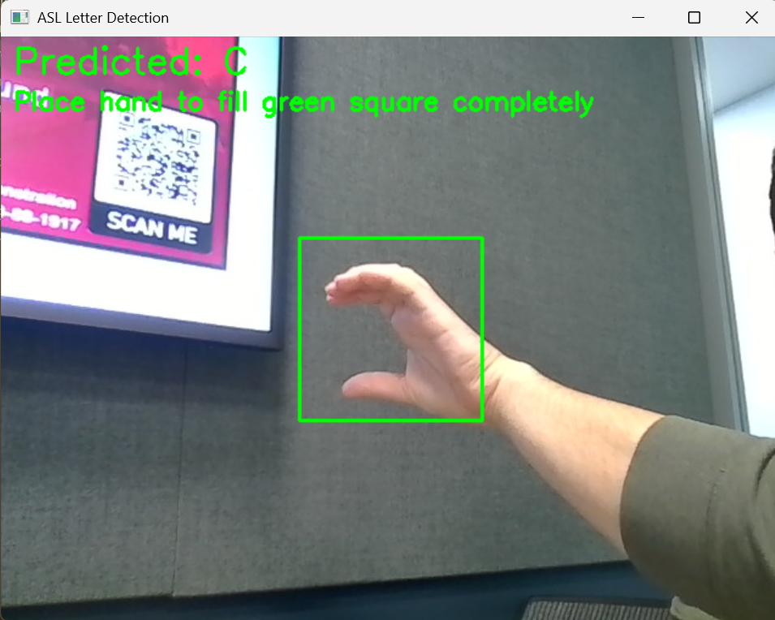

# hackhayward 2025 3/1/25
Project by Andreas Sotiras, Jonathan Cornejo, Nechar KC, Luan Luc

This project is a hackathon project that aims to create a sign language interpreter trained off of images of the letters for ASL.


## Example Images
Below are some example images used for training the model. These images are located in the `examples` folder.

### Example 1: ASL Trainer


### Example 2
Below are some examples of PREDICTIVE ASL BUDDY.


### Example 3


## Usage
This project uses a Convolutional Neural Network (CNN) to recognize ASL letters from webcam input. The model is trained on grayscale images of ASL letters and can predict the letter shown in the webcam feed.

### Steps to Use
1. **Install Dependencies**: Ensure you have all the required dependencies installed. You can install them using the `requirements.txt` file:
    ```bash
    pip install -r requirements.txt
    ```

2. **Prepare Dataset**: Place your dataset of ASL letter images in the [testingData](http://_vscodecontentref_/1) directory. The images should be organized into subdirectories named after the corresponding letters.

3. **Train the Model**: Run the [main_2.py](http://_vscodecontentref_/2) script to train the model. The script will load the dataset, train the model, and save it as [asl_model.h5](http://_vscodecontentref_/3).

4. **Run the Webcam ASL Interpreter**: After training, the script will start the webcam and begin predicting ASL letters. If the predicted letter remains the same for 3 seconds, it will be confirmed and displayed on the screen. If you want to train use the:

    ```bash
    python ASLtrainer.py
    ```

5. **Interpreting ASL Letters**: Place your hand within the green square on the webcam feed. The model will predict the ASL letter and display it on the screen. If the letter remains the same for 3 seconds, it will be confirmed.

### Example Output


## Contributors
- Andreas Sotiras
- Jonathan Cornejo
- Nechar KC
- Luan Luc
